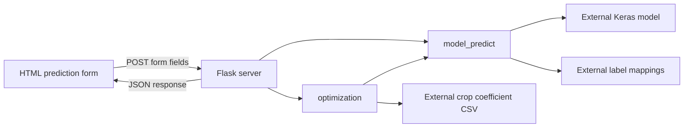

# farm-wise

**A Flask prototype for exploring crop recommendations from soil nutrients and weather measurements.**

farm-wise combines three model-backed prediction forms with a crop-sequencing experiment. Users enter soil or environmental measurements, and the Python backend loads trained classifiers to suggest crops, fertilizers, or fruits and vegetables. A separate page presents saved model charts, while a video-upload screen illustrates a future leaf-disease detection workflow.

**Repository status:** the web application and inference code are included. Trained models, label mappings, optimization datasets, and training notebooks are not included. You can run the interface after installing dependencies, but predictions require the external artifacts listed below. The disease-detection screen is a UI demonstration without an inference endpoint.

## Demo video

https://github.com/user-attachments/assets/98b9eeea-424c-4f64-b216-daf4d1404462

The original demonstration video is retained. It shows a demonstration environment; it does not mean that the model artifacts required to reproduce inference are bundled here.

## Contents

- [Features and current scope](#features-and-current-scope)
- [How it works](#how-it-works)
- [Local setup](#local-setup)
- [Required model and dataset files](#required-model-and-dataset-files)
- [Prediction inputs](#prediction-inputs)
- [Routes and API](#routes-and-api)
- [Repository structure](#repository-structure)
- [Verification](#verification)
- [Known limitations](#known-limitations)
- [Development priorities](#development-priorities)

## Features and current scope

| Area | What the repository implements |
| --- | --- |
| Soil and nutrition | A form and classifier-loading path for crop selection, plus a crop-to-fertilizer lookup. |
| Weather and nutrients | A form combining N/P/K, temperature, humidity, pH, and rainfall for crop classification. Weather values are entered manually. |
| Fruits and vegetables | An eleven-feature input path covering macronutrients, pH, electrical conductivity, and micronutrients. |
| Crop sequencing | A recursive routine that updates measurements using CSV coefficients and predicts another crop until a time threshold is crossed. |
| Model insights | Static images of model architecture, confusion matrices, and training curves. These are saved assets, not live evaluation results. |
| Leaf-disease detection | A video file picker that displays a placeholder image when submitted. No upload, localization, or classification backend is present. |
| Project presentation | A [concept presentation](ppt/farm-wise.pptx) outlining the broader project vision, including features beyond the implementation. |

The code does not include live sensors, weather-provider calls, yield forecasting, user accounts, a database, or an automated irrigation system.

## How it works



1. Flask renders a page from `templates/`.
2. jQuery serializes a prediction form and posts it to `/predict/<type>`.
3. `model_predict()` converts the fields into a NumPy array, loads the appropriate Keras model, and maps its highest-scoring output to a label.
4. For nutrition predictions, a separate mapping supplies fertilizers for the selected crop.
5. `optimization()` reads the crop's nutrient coefficients and time-to-yield value, updates the inputs, and repeats prediction recursively.
6. The route returns `data` and `time` as JSON. The frontend extracts the nested result and prints the sequence.

This sequencing routine is a heuristic experiment. It does not solve a constrained agronomic optimization problem, and the current recursion has result-shape and time-accounting issues described under [known limitations](#known-limitations).

## Local setup

### Prerequisites

- Python 3.11 is the suggested starting environment.
- `pip` and a virtual environment.
- A TensorFlow-supported operating system and Python architecture.
- Internet access for the Bootstrap, jQuery, Popper, and Google Fonts assets loaded by the templates.

No Node.js build, database, or API key is required by the included code.

### Install and run

```bash
git clone https://github.com/quixoticalcoder/farm-wise.git
cd farm-wise
python3 -m venv .venv
source .venv/bin/activate
pip install -r requirements.txt
python server.py
```

On Windows, activate the environment with `.venv\Scripts\activate`.

Open `http://127.0.0.1:5000`. Run the command from the repository root because model and dataset paths are relative to the working directory. The actual entry point is `server.py`.

The new [`requirements.txt`](requirements.txt) records the imported runtime dependencies with broad version bounds. It is not a lockfile or a reconstruction of the missing models' training environment. A model may need the TensorFlow/Keras versions or custom layers used when it was trained.

`python server.py` enables Flask debug mode for local development. For a local run without the debugger:

```bash
flask --app server:app run --host 127.0.0.1 --port 5000
```

### Interface-only use

All seven HTML pages can render without the missing model files once the Python dependencies are installed. Open the forms and model-insight gallery to explore the interface. Submitting a prediction will fail until its model, labels, and optimization CSV are supplied. TensorFlow is imported when the server starts, so it is still needed for interface-only use.

## Required model and dataset files

These paths are referenced by `model.py` but are **absent from the repository**. The `models/` and `datasets/` directories are ignored by Git.

| Prediction mode | Required artifacts |
| --- | --- |
| `nutrition` | `models/crop-model.h5`, `models/labels/crop_txt`, `models/fertilizers-model`, `models/labels/soil_color_txt` |
| `weather` | `models/crop-nutrients-model.h5`, `models/labels/weather_crop_labels` |
| `fruits` | `models/fruits_model.h5`, `models/labels/fruits_txt` |
| Nutrition sequencing | `datasets/optimization/Crop and fertilizer dataset percent.csv` |
| Weather sequencing | `datasets/optimization/Crop_recommendation percent.csv` |
| Fruit sequencing | `datasets/optimization/dataset percent.csv` |

The weather-label filename now uses the neutral name `weather_crop_labels`. If you have an older local copy, rename its weather label mapping to that name before running inference.

The `.h5` files must be compatible Keras classifiers whose output ordering matches the corresponding label mapping. Label files use Python pickle. The fertilizer artifact is treated as a crop-to-fertilizer mapping, despite its filename. The soil-color mapping must associate encoded values with the form's color labels. Only load trusted pickle artifacts, since deserialization can execute code.

The optimization CSVs must contain matching crop rows and these columns:

| CSV | Required columns |
| --- | --- |
| Nutrition | `Crop`, `Time to Yield`, `Nitrogen`, `Phosphorus`, `Potassium`, `pH`, `Rainfall`, `Temperature` |
| Weather | `crop`, `Time to Yield`, `N`, `P`, `K` |
| Fruits | `Crop`, `Time to Yield`, `N`, `P`, `K`, `pH`, `EC`, `S`, `Cu`, `Fe`, `Mn`, `B`, `Zn` |

No artifact download location, dataset provenance, preprocessing specification, or reproducible training script is provided. The table documents the code's expected interfaces; it does not imply these artifacts can be regenerated from this checkout alone.

## Prediction inputs

Field spelling and order matter because the code constructs arrays directly without a preprocessing pipeline.

| Mode | Input array order |
| --- | --- |
| Nutrition | Encoded `soilColor`, `nitrogen`, `phosphorous`, `potassium`, `pH`, `rainfall`, `temperature` |
| Weather | `N`, `P`, `K`, `temp`, `humidity`, `pH`, `rainfall` |
| Fruits | `N`, `P`, `K`, `pH`, `EC`, `S`, `Cu`, `Fe`, `Mn`, `Zn`, `B` |

N/P/K values are parsed as integers. Other numeric fields are parsed as floats. The nutrition form uses the spelling `phosphorous`, while its CSV uses `Phosphorus`. In the fruit model array, zinc precedes boron even though the form displays boron first.

The repository does not define a complete unit, normalization, or acceptable-range contract. Input measurements must match the missing training artifacts; arbitrary numbers cannot establish prediction validity.

## Routes and API

| Method | Route | Purpose |
| --- | --- | --- |
| GET | `/` | Landing page |
| GET | `/feature_screen` | Prediction mode selection |
| GET | `/nutrition` | Soil and nutrient form |
| GET | `/fruits` | Fruit and vegetable form |
| GET | `/weather` | Nutrient and weather form |
| GET | `/detection_screen` | Video-upload UI demonstration |
| GET | `/model_insight` | Saved model-chart gallery |
| POST | `/predict/nutrition` | Nutrition prediction and sequencing |
| POST | `/predict/weather` | Weather prediction and sequencing |
| POST | `/predict/fruits` | Fruit prediction and sequencing |

Prediction requests use form-encoded fields, not a JSON request body. For example, after providing compatible artifacts:

```bash
curl -X POST http://127.0.0.1:5000/predict/weather \
  --data-urlencode 'N=90' \
  --data-urlencode 'P=42' \
  --data-urlencode 'K=43' \
  --data-urlencode 'temp=20.8' \
  --data-urlencode 'humidity=82' \
  --data-urlencode 'pH=6.5' \
  --data-urlencode 'rainfall=203'
```

These numbers illustrate the request format only. A successful response has top-level `data` and `time` fields. The nested `data` structure is an implementation artifact, and `time` currently reflects the outer recursion step rather than a reliable total schedule duration.

## Repository structure

```text
farm-wise/
├── server.py                # Flask pages and prediction endpoint
├── model.py                 # Keras loading, label lookup, crop sequencing
├── requirements.txt         # Runtime dependencies
├── templates/
│   ├── index.html           # Landing page
│   ├── feature_screen.html  # Mode selection
│   ├── nutrition.html       # Crop and fertilizer form
│   ├── weather.html         # Crop form with weather measurements
│   ├── fruits.html          # Fruit and vegetable form
│   ├── detection_screen.html
│   └── model_insight.html
├── static/
│   ├── css/style.css
│   └── img/                 # Illustration and saved model-chart assets
└── ppt/farm-wise.pptx        # Concept presentation
```

## Verification

Check Python syntax with:

```bash
python -m compileall -q server.py model.py
```

For a manual interface check, run the server and visit all seven GET routes. Confirm the navigation, forms, and model images load. A submitted video on the detection screen should be understood as a placeholder interaction, not a detection result.

There is no committed automated test suite. Meaningful inference validation requires the original model artifacts, representative labeled data, and an explicit input contract. Page rendering or mocked predictions do not verify model quality, farming outcomes, or disease detection.

## Known limitations

- **Missing runtime data:** model weights, pickle mappings, optimization CSVs, and training notebooks are absent. End-to-end prediction cannot be reproduced from the repository alone.
- **Recursion and time accounting:** the optimizer wraps each recursive return in another tuple. Result nesting depends on the number of iterations, while the templates assume a fixed depth. The route receives an outer-step time value rather than the final accumulated time.
- **Stopping behavior:** the routine checks `time > 12` before adding the next crop's duration. It can overshoot the intended year and predicts another crop before the next stopping check. Zero or negative durations can prevent useful progress.
- **Nutrient updates:** CSV values are multiplied directly into the inputs; some values are cast to integers. The code does not establish whether a coefficient is a fraction, percentage, or absolute quantity, nor whether its updates reflect soil behavior.
- **Validation and errors:** unknown prediction types, missing fields, incompatible values, absent crop rows, and model-loading failures do not receive structured validation responses.
- **Model loading:** each prediction reloads the model and mapping files, including recursive calls, which adds avoidable latency.
- **Demonstration-only elements:** disease detection displays a fixed image, model insights show saved charts, and the landing-page contact form has no server-side submission handler.
- **Evidence:** the repository does not provide a reproducible evaluation, verified accuracy metrics, or evidence of improved yield. The concept presentation describes aspirations beyond the shipped application.

## Development priorities

1. Supply versioned artifacts with dataset provenance, feature units, preprocessing, and a reproducible training environment.
2. Replace the recursive return structure with an iterative planner returning a flat sequence and explicit durations.
3. Validate input ranges, supported modes, crop rows, and positive durations before inference.
4. Cache models and mappings, then test each mode with representative fixtures and failure cases.
5. Implement disease detection as a separate validated upload/inference workflow before presenting it as functional.

## Contributing and license

Use `farm-wise` consistently in project-facing text and filenames. Keep implementation claims tied to behavior that can be demonstrated, and include verification steps when changing inference or planning logic.

No license file is included. Check the rights for code, datasets, models, and third-party media before reuse. Existing media notices remain with their source assets.
